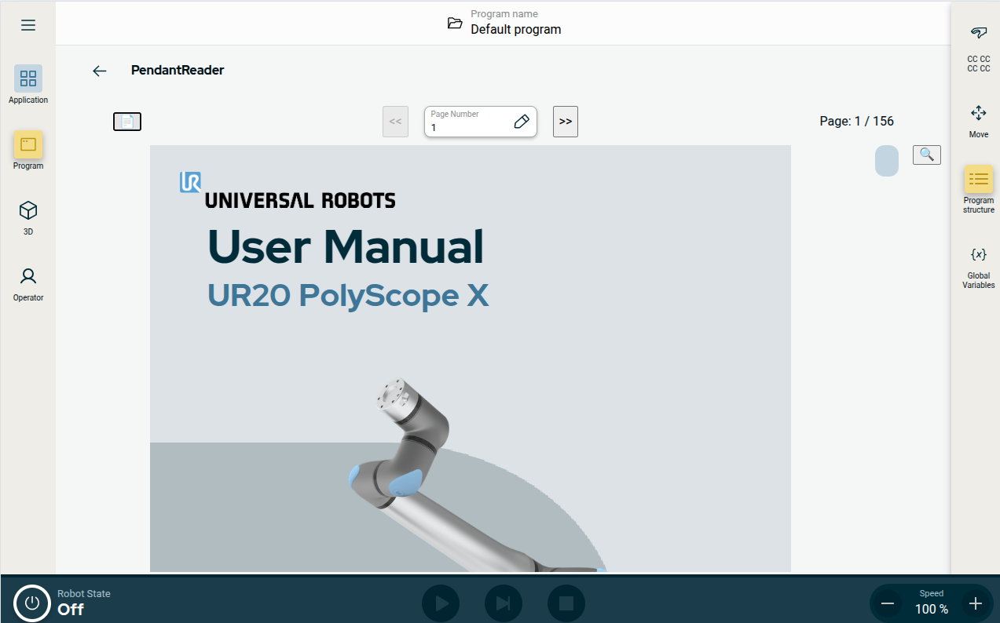
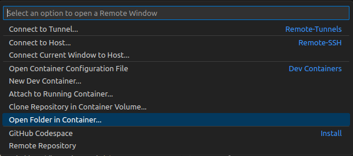
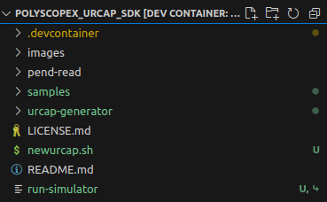

# PendantReader

In this day and age, almost everything has gone digital, including documentation. This has been done in an effort to reduce the use of paper and hopefully save a tree or two.

This URCap gives you access to the documentation right at your finger tips, while you are working with the robot.

As long as it is a UR robot from the e-series or a UR20 with Polyscope X installed, that is.

Note:
PolyScope X is, at time of writing, only available in a beta version.

For further details please see: [PolyScope X Open Beta ](https://forum.universal-robots.com/t/polyscope-x-open-beta-announcement/36988)

## A Word of Warning!

This URCapX in its current form, has only ever been run on a simulator, because of a current lack of the less then cheap hardware needed to run it on a physical system.

## Looks great, I want to use it (Installation the easy way)

Go to the "target" folder here on github and download the "pend-read-\*.urcapx" where * is the version number.
If using a real robot transfer it to a USB, insert the USB into the robot and press the so called "hamburger menu" button in the top left corner, press "System Manager -> URCaps" and install it by unlocking, using your password and pressing the "+ URCap" button.
The URCap should now be visible to you after exiting "System Manager" and pressing "Application".

For the simulator just skip the USB part, otherwise the rest should be the same.

## I want to modify it (Installation for further modification and/or development in VS Code)

NOTE: I am using linux, so this might be different on windows, but i suspect a lot of the step to be the same as most is done directly within VS Code.

For this guide to work you will first need to have installed [VS Code](https://code.visualstudio.com/), [Docker](https://code.visualstudio.com/docs/devcontainers/tutorial#_install-docker) and the [Docker Extension for VS Code](https://code.visualstudio.com/docs/devcontainers/tutorial#_install-the-extension).

First go to the official [Polyscope X SDK Github](https://github.com/UniversalRobots/PolyScopeX_URCap_SDK) and clone or download a copy of it.

Now open the folder in VS Code and in the lower left corner the "Docker Extension" should have added a blue button , press it.

Now choose the option "Open Folder in Container" .

Now please wait for the docker container to setup, as this will take some time, the first time around.

(To stop working inside the devcontainer just press the blue button once more and press "Reopen Folder Locally", but please wait to do so, until the end of this guide)

When its done it will have created a bunch of new files and folders.

(this paragraph might not be relevant on windows) As part of this process the permission to the main folder and its content is given to the docker container. We therefore now have two options. One, using chmod to change the permission of the folder back to something where we also can access it all or do the rest of the necessary steps directly inside VS Code and the open docker container.
As Im sure there is a good reason for this permission changes? let proceed to do everything from VS Code.

###### With GIT:

Inside VS Code with the project opened inside the container. Open a new terminal and git clone this project such that it lays besides the "samples", "images" and "urcap-generator" folders.

###### Without GIT:

With the Polyscope X SDK open within the devcontainer in VS Code. Simply drag and drop the top folder of a downloaded version of this code base into VS Code

<br>

Your file tree should then look like the structure below.

.

Now inside the terminal move to the URCap folder:

```bash
cd ./pend-read
```

and call the install script

```bash
./install.sh
```

Then go back and start the URSim

```bash
cd ..
./run-simulator
```

after some time the simulator should be up at running as a local webserver on your pc at [http://localhost/](http://localhost/), be sure to open the simulator in a Chrome based browser (Chrome, Chromium, Edge and others), as it only work 100% here.

Open a new terminal again.
Go back to the URCap and run the build script, to build the URCap and "push" it to the simulator

```bash
cd ./pend-read
./build-urcap.sh
```

This is also the script you will want to run when you have made any changes to the code.

Now go to the simulator in your browser and refresh the page. The Urcap should now be visible to you after you have pressed "Application".

### Further help needed?

Get more help directly from the source [Polyscope X SDK documentation](https://docs.universal-robots.com/PolyScopeX_SDK_Documentation/build/PSX-SDK-v0.12/GettingStarted.html#cheatsheet) , [Universal Robots Dicord](https://discord.com/invite/sEjRgEf6fp) or [Universal Robots Forum](https://forum.universal-robots.com)

## I've found a bug what now?

Please do report it, but know that Polyscope X is also just in a beta version, and because of that there might be bugs that simply is not the fault of this URCap.

## Credit Where Credit is Due
Like this project?

This project was only made possible because of the free
and open source repository [ng2-pdf-viewer](https://github.com/VadimDez/ng2-pdf-viewer) by Vadym Yatsyuk, so if this project made you fell the need to donate a cup of joe to a hard working software developer, do look his way instead of mine, you'll find a link a the bottom of his github page!

## What Does the Future Bring?
While I  do think that the current version is doing its job, it is really only doing the minimum you would expect from a PDF reader.

The fist step is getting it in hands of people, and running on some real robots. There after there is a lot of places for continues development.

###### Framework Related

While I have previously created URCaps and programed in JavaScript, this is my first URCap for PolyScope X, and my first time ever working in TypeScript and Angular.

I would therefore love to get to know the ins and outs of it all by:
 
 1. Creating support for multiple languages
 2. Learning how unit test are supported in this framework and adding them
  
###### Robot Related

I would also love to find a way to bind a robot program to a certain PDF.
This would allow a welder or machinist to bind a drawing of a part to its program, making it easy to identify what part the program is related to, when its opened at a later date.

###### General PDF Reader Related

There is in general, a lot of features missing, that you would expect from a modern PDF Reader like zoom, search, bookmarks, "fit to width", "fit to height" and the list continues.
All of which could be nice to implement at some point.
